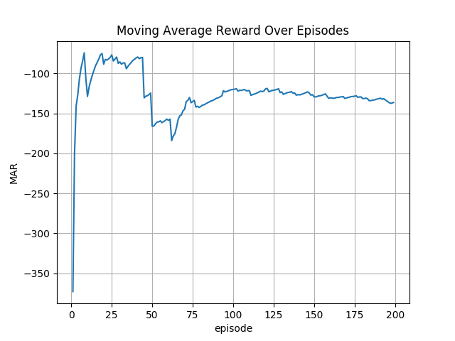

## Intro
This is an experimental repo for myself to play with my implementation of DDPG.

## Dependencies
- Python: 3.x
- Tensorflow-gpu: 1.14.0

## Usage
Try below.  
`python main.py`

## Result
- Moving Average Reward


- Trained Policy of Ant-v3 on the rendered env


## Reference
```shell
@article{lillicrap2015continuous,
  title={Continuous control with deep reinforcement learning},
  author={Lillicrap, Timothy P and Hunt, Jonathan J and Pritzel, Alexander and Heess, Nicolas and Erez, Tom and Tassa, Yuval and Silver, David and Wierstra, Daan},
  journal={arXiv preprint arXiv:1509.02971},
  year={2015}
}
```